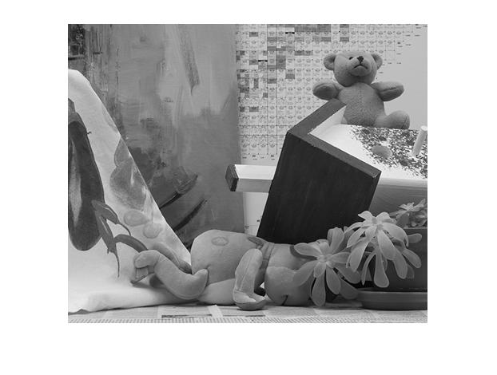
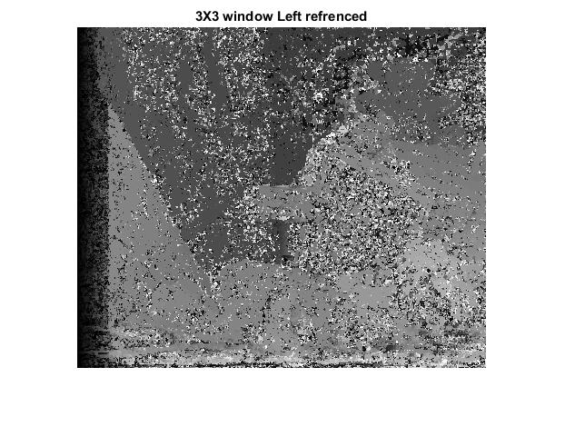
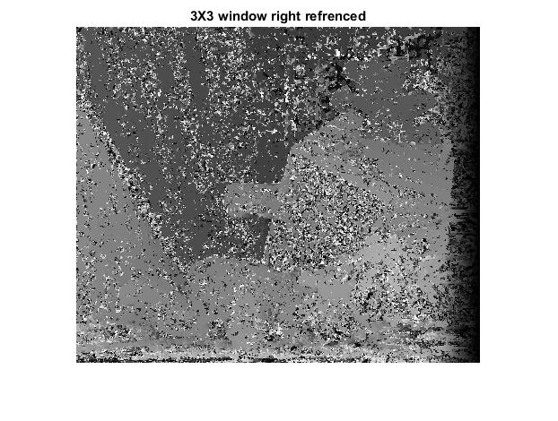
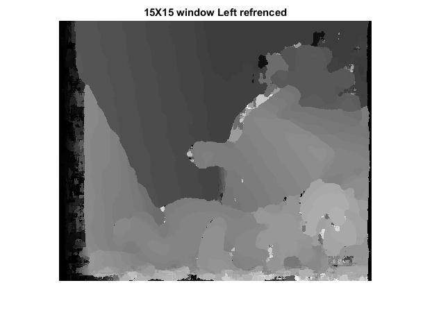
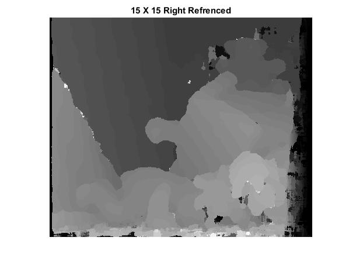
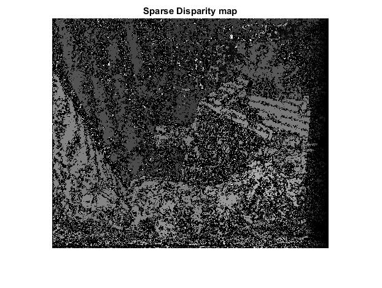

I used 2 grayscale images (Left and Right) and converted them into their disparity map.
Process:
1. Convert Image (Left and Right) into rank Transformed Image using 5X5 window.
2. Use Rank transformed Image to calculate SAD (Sum of Absolute Difference) by taking Right Image as refrence and sliding window in Left image.
    For this I considered 3X3 window and 15X15 window and compared their outputs.
    This step helps in detecting the corresponding pixels in left image.
3. Used sad values to find minimum disparity value and stored into new image to form disparity map.
4. Compared disparity map with original ground truth available and calculated error rate.
5. Found 50% above confidence value and generated Sparse disparity map.
Original Left Image

Output:
This is the disparity map when I took 3X3 window and left image as refrence.

This is the disparity map when I took 3X3 window and right image as refrence. 
Above both images shows that result for 3X3 window is not good enough.

This is the disparity map when I took 15X15 window and left image as refrence.

This is the disparity map when I took 15X15 window and right image as refrence.

Conclusion:
On taking 3X3 window for SAD and slide on left/right image,the results are not clear enough, it has lots of noise.
Whereas in 15X15 window disparity map is much clearer.
Which mean window size shouldn't be very small, but also not very high.
Error rate for 3X3 : 27%
for 15X15:16%
