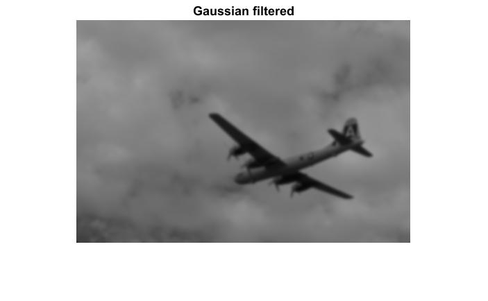
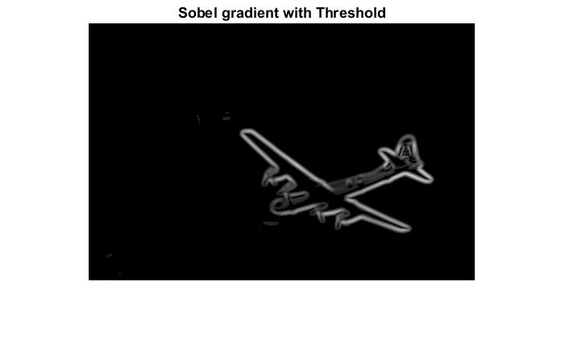
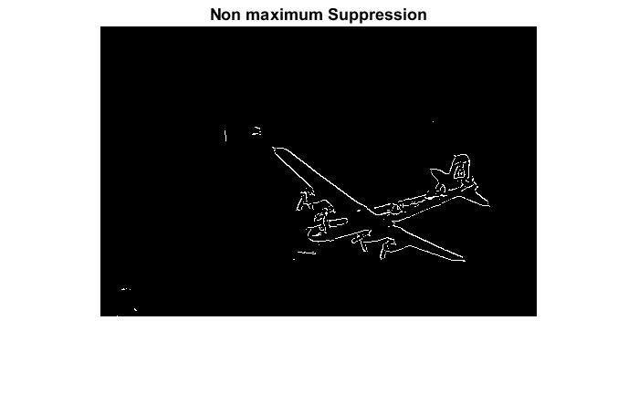

For Edge Detection I first smoothen the image using Gaussian Filtering.
I have used sigma value=1 for gaussian filtering.
This whole process make canny edge filter.

Original image

Gaussian Image

Sobel Gradient (Edge Detected)

Non-maximum Suppression

