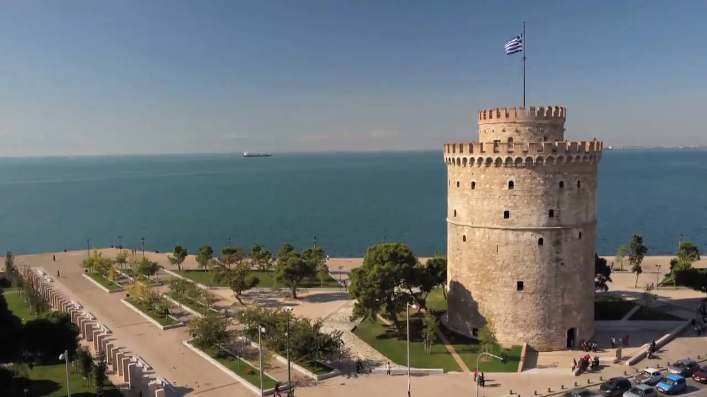

K-Means is a clustering algorithm. That means you can "group" points based on their neighbourhood.
When a lot of points a near by, you mark them as one cluster. With K-means, you can find good center points for these clusters.

This "clustering" is not limited to two dimensions. You can have points in 3 dimensions. Or any number of dimensions you want.

The aim of this project was too apply Kmeans segmentation on white-tower image for different k values.
For initialization I randomly picked 10 RGB triplets.

Original Image

Output Image for K=2

Output Image for k=10

