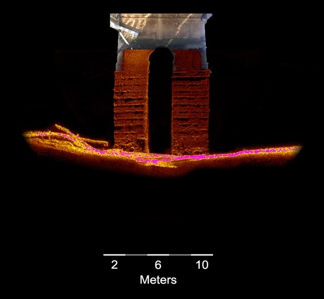
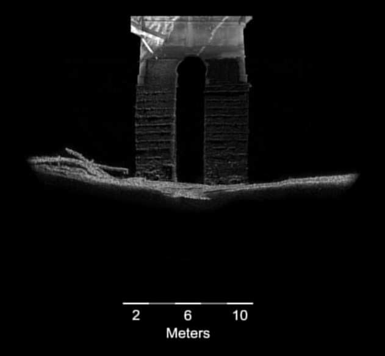

It has a code of Savitzky golay Flter using OpenCv in C++. Since, 
This filter is not available in Opencv so I have created it using custom kernel.

A Savitzky–Golay filter is a digital filter that can be applied to a set of digital data points for the purpose of smoothing the data, that is, to increase the signal-to-noise ratio without greatly distorting the signal. This is achieved, in a process known as convolution, by fitting successive sub-sets of adjacent data points with a low-degree polynomial by the method of linear least squares. When the data points are equally spaced, an analytical solution to the least-squares equations can be found, in the form of a single set of "convolution coefficients" that can be applied to all data sub-sets, to give estimates of the smoothed signal, (or derivatives of the smoothed signal) at the central point of each sub-set.

Original image

Savitzky Golay Filtered Image

