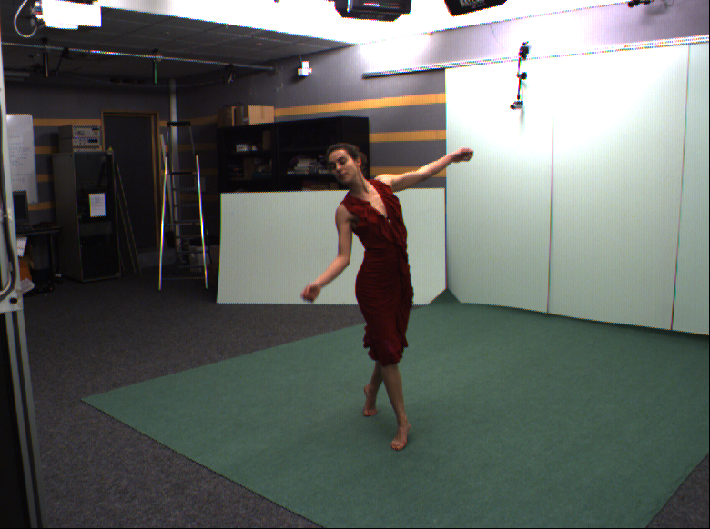
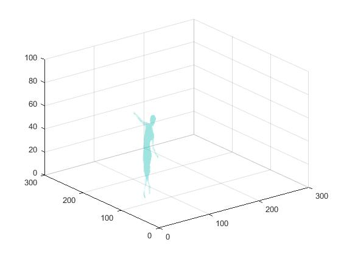
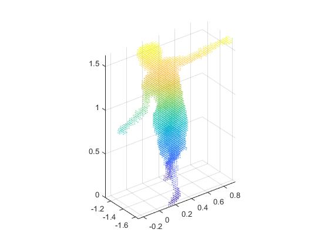
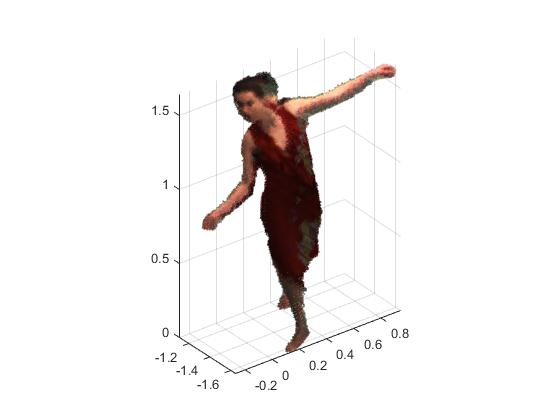

In this repository I had 8 images from different angles of a lady in dancing position, 
8 silhotte images of original images 
and 8 camera matrix for each silhoutte image.

Using these images and matrix I designed 3d model of lady in dancing position.

A type of input image. total 8 such images were used.

Siphoutte image of one of the original image

Output:

3d visualisation in matlab

point cloud data

Point cloud with colors display

